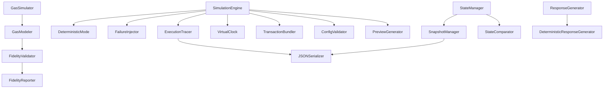
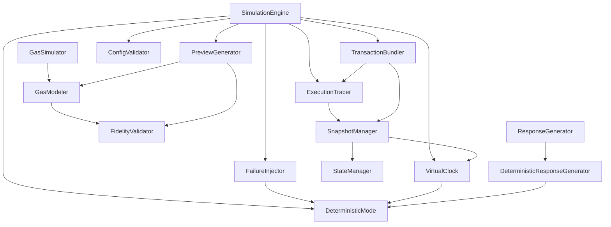

# Design Document: Simulation Stack Hardening

## Overview

The Simulation Stack Hardening feature transforms the existing simulation infrastructure from a development scaffolding tool into a production-grade pre-execution environment. This design extends the current `SimulationEngine`, `StateManager`, `ResponseGenerator`, and `GasSimulator` components with deterministic execution, comprehensive failure modeling, execution tracing, state management, and fidelity validation capabilities.

### Design Goals

1. **Deterministic Reproducibility**: Enable identical simulation results for identical inputs through seeded pseudo-random number generation
2. **Comprehensive Failure Testing**: Provide systematic failure injection across all blockchain failure modes
3. **Complete Observability**: Capture detailed execution traces for debugging and analysis
4. **State Management**: Support snapshot/restore operations for efficient testing workflows
5. **High Fidelity**: Ensure simulation results closely match real network behavior
6. **Performance**: Maintain sub-200ms execution times for complex operations
7. **Production Readiness**: Provide validation, safety checks, and serialization for production use

### Key Architectural Principles

- **Backward Compatibility**: All enhancements extend existing components without breaking current functionality
- **Separation of Concerns**: New capabilities are modular and can be enabled/disabled independently
- **Minimal Overhead**: Deterministic mode and tracing add <10% performance overhead when disabled
- **Type Safety**: Comprehensive TypeScript types for all new data structures
- **Testability**: All components designed for property-based testing with clear invariants

## Architecture

### Component Overview



### Component Responsibilities

| Component                        | Responsibility                                     | New/Modified |
| -------------------------------- | -------------------------------------------------- | ------------ |
| `SimulationEngine`               | Orchestration, mode management, request processing | Modified     |
| `DeterministicMode`              | Seeded RNG management, deterministic execution     | New          |
| `FailureInjector`                | Failure scenario configuration and injection       | New          |
| `ExecutionTracer`                | Trace capture, recording, and management           | New          |
| `VirtualClock`                   | Simulated time progression                         | New          |
| `TransactionBundler`             | Multi-operation atomic execution                   | New          |
| `StateManager`                   | State storage and manipulation                     | Modified     |
| `SnapshotManager`                | Snapshot creation, storage, and restoration        | New          |
| `StateComparator`                | State difference detection                         | New          |
| `GasSimulator`                   | Gas estimation                                     | Modified     |
| `GasModeler`                     | Operation-specific gas models                      | New          |
| `FidelityValidator`              | Simulation accuracy measurement                    | New          |
| `FidelityReporter`               | Fidelity reporting and alerting                    | New          |
| `ResponseGenerator`              | Response generation                                | Modified     |
| `DeterministicResponseGenerator` | Deterministic hash/address generation              | New          |
| `JSONSerializer`                 | Trace and snapshot serialization                   | New          |
| `ConfigValidator`                | Configuration validation and safety checks         | New          |
| `PreviewGenerator`               | Human-readable execution previews                  | New          |

## Components and Interfaces

### 1. DeterministicMode

Manages seeded pseudo-random number generation for reproducible simulations.

```typescript
interface DeterministicConfig {
  enabled: boolean;
  seed?: number; // If not provided, generate and log
  strictMode: boolean; // Fail if any non-deterministic operation detected
}

class DeterministicMode {
  private seed: number;
  private rng: SeededRNG;
  private operationCount: number = 0;

  constructor(config: DeterministicConfig);

  // Get next random value in deterministic sequence
  nextRandom(): number;

  // Get next random integer in range [min, max]
  nextInt(min: number, max: number): number;

  // Get next random boolean with given probability
  nextBoolean(probability: number): boolean;

  // Generate deterministic hash
  generateHash(prefix: string): string;

  // Generate deterministic address
  generateAddress(prefix: string): string;

  // Get current seed for reproducibility
  getSeed(): number;

  // Reset RNG to initial state
  reset(): void;

  // Get operation count (for debugging)
  getOperationCount(): number;
}

// Seeded RNG implementation using Mulberry32 algorithm
class SeededRNG {
  private state: number;

  constructor(seed: number);
  next(): number; // Returns value in [0, 1)
  clone(): SeededRNG;
}
```

**Design Decisions**:

- Use Mulberry32 algorithm for fast, high-quality pseudo-random numbers
- Track operation count to detect divergence in replay scenarios
- Support strict mode to catch accidental non-deterministic operations
- Generate deterministic hashes using seed + operation count + prefix

### 2. FailureInjector

Manages failure scenario configuration and injection.

```typescript
type FailureType =
  | "network_timeout"
  | "gas_exhaustion"
  | "contract_revert"
  | "insufficient_balance"
  | "nonce_conflict"
  | "invalid_signature"
  | "rate_limit"
  | "node_unavailable";

interface FailureTrigger {
  type: "operation" | "parameter" | "state" | "count" | "probability";
  condition: FailureCondition;
}

interface FailureCondition {
  // For 'operation' trigger
  operationType?: string;

  // For 'parameter' trigger
  parameterName?: string;
  parameterValue?: unknown;
  parameterComparator?: "eq" | "gt" | "lt" | "contains";

  // For 'state' trigger
  stateQuery?: (state: SimulationState) => boolean;

  // For 'count' trigger
  executionCount?: number;

  // For 'probability' trigger
  probability?: number; // 0.0 to 1.0
}

interface FailureScenario {
  id: string;
  name: string;
  failureType: FailureType;
  trigger: FailureTrigger;
  priority: number; // Higher priority scenarios checked first
  enabled: boolean;
  errorMessage?: string; // Custom error message
  errorDetails?: Record<string, unknown>; // Additional error context
}

interface FailureInjectionResult {
  injected: boolean;
  scenario?: FailureScenario;
  error?: Error;
}

class FailureInjector {
  private scenarios: Map<string, FailureScenario> = new Map();
  private executionCounts: Map<string, number> = new Map();
  private deterministicMode?: DeterministicMode;

  constructor(deterministicMode?: DeterministicMode);

  // Register a failure scenario
  registerScenario(scenario: FailureScenario): void;

  // Remove a failure scenario
  removeScenario(scenarioId: string): void;

  // Check if failure should be injected for current operation
  shouldInjectFailure(
    operation: SimulationRequest,
    state: SimulationState
  ): FailureInjectionResult;

  // Generate error for failure type
  generateError(scenario: FailureScenario): Error;

  // Get all active scenarios
  getActiveScenarios(): FailureScenario[];

  // Reset execution counts
  reset(): void;
}
```

**Design Decisions**:

- Support multiple trigger types for flexibility
- Priority-based scenario evaluation for overlapping triggers
- Integration with DeterministicMode for reproducible probability-based failures
- Track execution counts per operation type for count-based triggers

### 3. ExecutionTracer

Captures complete execution traces for analysis and debugging.

```typescript
interface ExecutionTrace {
  traceId: string;
  seed: number | null; // Simulation seed if deterministic mode enabled
  startTime: number; // Real time (milliseconds since epoch)
  endTime: number;
  virtualStartTime: number; // Virtual clock time
  virtualEndTime: number;
  mode: SimulationMode;
  operations: OperationTrace[];
  failureScenarios: FailureScenario[];
  finalState: StateSnapshot;
  metadata: TraceMetadata;
}

interface OperationTrace {
  operationId: string;
  sequenceNumber: number;
  timestamp: number; // Real time
  virtualTimestamp: number; // Virtual clock time
  request: SimulationRequest;
  response: SimulationResponse | null;
  error: ErrorTrace | null;
  gasEstimate: GasEstimate;
  gasActual: number;
  stateChanges: StateChange[];
  beforeSnapshot: StateSnapshot;
  afterSnapshot: StateSnapshot;
  duration: number; // Microseconds
  injectedFailure: FailureScenario | null;
}

interface ErrorTrace {
  message: string;
  stack: string;
  type: string;
  code?: string;
  details?: Record<string, unknown>;
}

interface TraceMetadata {
  version: string; // Trace format version
  engineVersion: string; // Simulation engine version
  totalOperations: number;
  successfulOperations: number;
  failedOperations: number;
  totalGasUsed: number;
  totalDuration: number;
  warnings: string[];
}

class ExecutionTracer {
  private currentTrace: ExecutionTrace | null = null;
  private operationSequence: number = 0;

  // Start a new trace
  startTrace(config: {
    seed: number | null;
    mode: SimulationMode;
    failureScenarios: FailureScenario[];
  }): string; // Returns traceId

  // Record an operation
  recordOperation(trace: OperationTrace): void;

  // Record a warning
  recordWarning(message: string): void;

  // Complete the current trace
  completeTrace(finalState: StateSnapshot): ExecutionTrace;

  // Get current trace (for inspection)
  getCurrentTrace(): ExecutionTrace | null;

  // Serialize trace to JSON
  serializeTrace(trace: ExecutionTrace): string;

  // Parse trace from JSON
  parseTrace(json: string): ExecutionTrace;
}
```

**Design Decisions**:

- Capture both real time and virtual time for all operations
- Include before/after snapshots for each operation to enable rollback
- Store complete error context including stack traces
- Version the trace format for backward compatibility
- Separate trace ID from seed for clarity

### 4. VirtualClock

Manages simulated time progression for time-dependent testing.

```typescript
interface VirtualClockConfig {
  enabled: boolean;
  startTime: number; // Initial virtual time (milliseconds since epoch)
  autoAdvance: boolean; // Automatically advance time with operations
  autoAdvanceAmount: number; // Milliseconds to advance per operation
}

class VirtualClock {
  private enabled: boolean;
  private virtualTime: number;
  private realStartTime: number;
  private config: VirtualClockConfig;

  constructor(config: VirtualClockConfig);

  // Get current virtual time
  now(): number;

  // Get current real time
  realNow(): number;

  // Advance virtual time by duration
  advance(milliseconds: number): void;

  // Set virtual time to specific value
  setTime(timestamp: number): void;

  // Reset virtual clock
  reset(startTime?: number): void;

  // Check if virtual clock is enabled
  isEnabled(): boolean;

  // Get time offset (virtual - real)
  getOffset(): number;
}
```

**Design Decisions**:

- Support both manual and automatic time advancement
- Track both virtual and real time for trace analysis
- Allow setting absolute time for testing specific timestamps
- Simple API that mirrors Date.now() for easy integration

### 5. TransactionBundler

Manages atomic execution of multi-operation transactions.

```typescript
interface TransactionBundle {
  bundleId: string;
  operations: SimulationRequest[];
  atomicity: "atomic" | "best-effort"; // atomic = rollback on any failure
  ordering: "sequential" | "parallel"; // execution order
}

interface BundleExecutionResult {
  bundleId: string;
  success: boolean;
  results: SimulationResponse[];
  totalGas: number;
  rolledBack: boolean;
  failedOperationIndex: number | null;
  trace: ExecutionTrace;
}

class TransactionBundler {
  private stateManager: StateManager;
  private snapshotManager: SnapshotManager;
  private executionTracer: ExecutionTracer;

  constructor(
    stateManager: StateManager,
    snapshotManager: SnapshotManager,
    executionTracer: ExecutionTracer
  );

  // Execute a transaction bundle
  async executeBundle(
    bundle: TransactionBundle,
    executor: (request: SimulationRequest) => Promise<SimulationResponse>
  ): Promise<BundleExecutionResult>;

  // Validate bundle (check dependencies, conflicts)
  validateBundle(bundle: TransactionBundle): ValidationResult;

  // Analyze bundle for optimization opportunities
  analyzeBundle(bundle: TransactionBundle): BundleAnalysis;
}

interface ValidationResult {
  valid: boolean;
  errors: string[];
  warnings: string[];
}

interface BundleAnalysis {
  canParallelize: boolean;
  dependencies: Map<number, number[]>; // operation index -> dependent operation indices
  estimatedGas: number;
  riskLevel: "low" | "medium" | "high";
}
```

**Design Decisions**:

- Support both atomic and best-effort execution modes
- Automatic snapshot creation before bundle execution
- Rollback on failure for atomic bundles
- Dependency analysis for parallel execution optimization
- Risk assessment based on operation types and amounts

### 6. SnapshotManager

Manages state snapshot creation, storage, and restoration.

```typescript
interface StateSnapshot {
  snapshotId: string;
  timestamp: number;
  virtualTimestamp: number;
  accounts: Map<string, AccountState>;
  contracts: Map<string, ContractState>;
  metadata: SnapshotMetadata;
}

interface SnapshotMetadata {
  name?: string;
  description?: string;
  tags: string[];
  parentSnapshotId?: string; // For snapshot chains
  size: number; // Bytes
}

interface SnapshotDiff {
  addedAccounts: string[];
  removedAccounts: string[];
  modifiedAccounts: Map<string, AccountStateDiff>;
  addedContracts: string[];
  removedContracts: string[];
  modifiedContracts: Map<string, ContractStateDiff>;
}

interface AccountStateDiff {
  balanceChanges: Map<string, { before: string; after: string }>;
  sequenceChange: { before: number; after: number } | null;
  trustlineChanges: TrustlineDiff[];
}

interface ContractStateDiff {
  storageChanges: Map<string, { before: unknown; after: unknown }>;
  codeChanged: boolean;
}

interface TrustlineDiff {
  asset: string;
  change: "added" | "removed" | "modified";
  before?: StellarTrustline;
  after?: StellarTrustline;
}

class SnapshotManager {
  private snapshots: Map<string, StateSnapshot> = new Map();
  private stateManager: StateManager;
  private virtualClock: VirtualClock;

  constructor(stateManager: StateManager, virtualClock: VirtualClock);

  // Create a snapshot of current state
  createSnapshot(metadata?: Partial<SnapshotMetadata>): StateSnapshot;

  // Restore state from snapshot
  restoreSnapshot(snapshotId: string): void;

  // Get snapshot by ID
  getSnapshot(snapshotId: string): StateSnapshot | undefined;

  // List all snapshots
  listSnapshots(): SnapshotMetadata[];

  // Delete snapshot
  deleteSnapshot(snapshotId: string): void;

  // Compare two snapshots
  compareSnapshots(snapshotId1: string, snapshotId2: string): SnapshotDiff;

  // Serialize snapshot to JSON
  serializeSnapshot(snapshot: StateSnapshot): string;

  // Deserialize snapshot from JSON
  deserializeSnapshot(json: string): StateSnapshot;

  // Save snapshot to disk
  async saveSnapshotToDisk(snapshotId: string, filepath: string): Promise<void>;

  // Load snapshot from disk
  async loadSnapshotFromDisk(filepath: string): Promise<StateSnapshot>;
}
```

**Design Decisions**:

- Support named snapshots with metadata for organization
- Efficient diff computation for large state spaces
- Snapshot chaining to track state evolution
- Disk persistence for long-term storage
- Deep cloning to prevent accidental state mutation

### 7. GasModeler

Provides operation-specific gas models with confidence intervals.

```typescript
interface GasModel {
  operationType: string;
  baseGas: number;
  parameterMultipliers: Map<string, (value: unknown) => number>;
  complexityFactors: ComplexityFactor[];
  historicalData: GasDataPoint[];
  confidence: number; // 0.0 to 1.0
}

interface ComplexityFactor {
  name: string;
  calculator: (params: Record<string, unknown>) => number;
  weight: number;
}

interface GasDataPoint {
  timestamp: number;
  actualGas: number;
  estimatedGas: number;
  parameters: Record<string, unknown>;
  network: string;
}

interface GasEstimateWithConfidence extends GasEstimate {
  confidence: number;
  confidenceInterval: {
    min: number;
    expected: number;
    max: number;
  };
  modelVersion: string;
}

class GasModeler {
  private models: Map<string, GasModel> = new Map();
  private fidelityValidator: FidelityValidator;

  constructor(fidelityValidator: FidelityValidator);

  // Register a gas model for an operation type
  registerModel(model: GasModel): void;

  // Estimate gas with confidence interval
  estimateGas(operation: BlockchainOperation): GasEstimateWithConfidence;

  // Update model with actual gas consumption data
  updateModel(operationType: string, dataPoint: GasDataPoint): void;

  // Get model for operation type
  getModel(operationType: string): GasModel | undefined;

  // Calibrate model based on historical data
  calibrateModel(operationType: string): void;

  // Get model confidence score
  getModelConfidence(operationType: string): number;
}
```

**Design Decisions**:

- Separate base gas from complexity factors for maintainability
- Track historical data for model calibration
- Provide confidence intervals (min/expected/max) for risk assessment
- Support parameter-specific multipliers for fine-grained estimation
- Model versioning for tracking improvements

### 8. FidelityValidator

Measures and reports simulation accuracy against real network behavior.

```typescript
interface FidelityMetrics {
  operationType: string;
  service: string;
  totalComparisons: number;
  gasAccuracy: number; // Percentage
  stateAccuracy: number; // Percentage
  timingAccuracy: number; // Percentage
  errorAccuracy: number; // Percentage (correct error predictions)
  overallFidelity: number; // Weighted average
  lastUpdated: number;
}

interface FidelityComparison {
  comparisonId: string;
  timestamp: number;
  operationType: string;
  simulatedResult: SimulationResponse;
  actualResult: unknown; // Real network result
  gasDeviation: number; // Percentage
  stateMatch: boolean;
  timingDeviation: number; // Milliseconds
  errorMatch: boolean;
}

interface FidelityAlert {
  alertId: string;
  timestamp: number;
  severity: "warning" | "critical";
  operationType: string;
  currentFidelity: number;
  threshold: number;
  message: string;
  recommendations: string[];
}

class FidelityValidator {
  private metrics: Map<string, FidelityMetrics> = new Map();
  private comparisons: FidelityComparison[] = [];
  private thresholds: Map<string, number> = new Map();
  private alertCallbacks: ((alert: FidelityAlert) => void)[] = [];

  // Record a comparison between simulation and actual execution
  recordComparison(comparison: FidelityComparison): void;

  // Get fidelity metrics for operation type
  getMetrics(operationType: string): FidelityMetrics | undefined;

  // Get overall fidelity score
  getOverallFidelity(): number;

  // Set fidelity threshold for operation type
  setThreshold(operationType: string, threshold: number): void;

  // Register alert callback
  onAlert(callback: (alert: FidelityAlert) => void): void;

  // Generate fidelity report
  generateReport(timeRange?: { start: number; end: number }): FidelityReport;

  // Manual validation (operator confirms accuracy)
  recordManualValidation(
    operationType: string,
    accurate: boolean,
    notes?: string
  ): void;
}

interface FidelityReport {
  generatedAt: number;
  timeRange: { start: number; end: number };
  overallFidelity: number;
  operationMetrics: FidelityMetrics[];
  trends: FidelityTrend[];
  alerts: FidelityAlert[];
  recommendations: string[];
}

interface FidelityTrend {
  operationType: string;
  direction: "improving" | "declining" | "stable";
  changeRate: number; // Percentage per day
}
```

**Design Decisions**:

- Multi-dimensional fidelity measurement (gas, state, timing, errors)
- Configurable thresholds per operation type
- Alert system for proactive monitoring
- Trend analysis to detect degradation
- Support for manual validation of critical operations

### 9. PreviewGenerator

Generates human-readable execution previews for user interfaces.

```typescript
interface ExecutionPreview {
  summary: string;
  operations: OperationPreview[];
  totalGas: GasEstimateWithConfidence;
  stateChanges: StateChangePreview[];
  risks: RiskAssessment[];
  warnings: Warning[];
  confidence: number;
  fidelityScore: number;
}

interface OperationPreview {
  operationNumber: number;
  description: string;
  service: string;
  operationType: string;
  parameters: Record<string, unknown>;
  expectedOutcome: string;
  gasEstimate: GasEstimateWithConfidence;
  risks: RiskAssessment[];
}

interface StateChangePreview {
  type: "balance" | "storage" | "trustline" | "sequence";
  entity: string; // Account or contract ID
  description: string;
  before: string;
  after: string;
  impact: "low" | "medium" | "high";
}

interface RiskAssessment {
  riskType:
    | "high_gas"
    | "large_transfer"
    | "irreversible"
    | "low_fidelity"
    | "state_divergence";
  severity: "low" | "medium" | "high" | "critical";
  description: string;
  mitigation?: string;
}

interface Warning {
  type:
    | "state_divergence"
    | "low_confidence"
    | "failure_scenario"
    | "configuration";
  message: string;
  details?: string;
}

class PreviewGenerator {
  private fidelityValidator: FidelityValidator;
  private gasModeler: GasModeler;

  constructor(fidelityValidator: FidelityValidator, gasModeler: GasModeler);

  // Generate preview for single operation
  generateOperationPreview(
    request: SimulationRequest,
    trace: OperationTrace
  ): OperationPreview;

  // Generate preview for transaction bundle
  generateBundlePreview(
    bundle: TransactionBundle,
    trace: ExecutionTrace
  ): ExecutionPreview;

  // Assess risks for operation
  assessRisks(
    request: SimulationRequest,
    trace: OperationTrace
  ): RiskAssessment[];

  // Generate warnings
  generateWarnings(trace: ExecutionTrace, fidelityScore: number): Warning[];

  // Format preview as HTML
  formatAsHTML(preview: ExecutionPreview): string;

  // Format preview as plain text
  formatAsText(preview: ExecutionPreview): string;
}
```

**Design Decisions**:

- Human-readable descriptions for all operations and state changes
- Risk-based highlighting for user attention
- Confidence and fidelity scores for trust assessment
- Multiple output formats (structured, HTML, text)
- Impact assessment for state changes

### 10. ConfigValidator

Validates simulation configuration and detects unsafe conditions.

```typescript
interface ValidationError {
  field: string;
  message: string;
  severity: "error" | "warning";
}

interface StateHealthCheck {
  healthy: boolean;
  divergenceScore: number; // 0.0 to 1.0
  issues: StateIssue[];
  recommendations: string[];
}

interface StateIssue {
  type: "divergence" | "inconsistency" | "missing_data";
  entity: string;
  description: string;
  severity: "low" | "medium" | "high";
}

class ConfigValidator {
  // Validate simulation configuration
  validateConfig(config: SimulationConfig): ValidationError[];

  // Validate failure scenarios
  validateFailureScenarios(
    scenarios: FailureScenario[],
    mode: SimulationMode
  ): ValidationError[];

  // Check state health
  checkStateHealth(
    simulatedState: StateSnapshot,
    liveState?: StateSnapshot
  ): StateHealthCheck;

  // Validate transaction bundle
  validateBundle(bundle: TransactionBundle): ValidationError[];

  // Check for configuration conflicts
  detectConflicts(config: SimulationConfig): ValidationError[];

  // Validate snapshot compatibility
  validateSnapshot(snapshot: StateSnapshot): ValidationError[];
}
```

**Design Decisions**:

- Comprehensive validation at initialization time
- Runtime health checks for state divergence
- Severity levels for errors vs warnings
- Actionable recommendations for issues
- Compatibility checks for snapshots and bundles

## Data Models

### Extended SimulationConfig

```typescript
interface SimulationConfig {
  // Existing fields
  mode: SimulationMode;
  enabledServices: string[];
  stellar: StellarConfig;
  starknet: StarknetConfig;
  simulation: SimulationSettings;

  // New fields for hardening
  deterministic?: DeterministicConfig;
  failureInjection?: FailureInjectionConfig;
  tracing?: TracingConfig;
  virtualClock?: VirtualClockConfig;
  fidelity?: FidelityConfig;
  performance?: PerformanceConfig;
}

interface FailureInjectionConfig {
  enabled: boolean;
  scenarios: FailureScenario[];
}

interface TracingConfig {
  enabled: boolean;
  captureSnapshots: boolean;
  maxTraceSize: number; // Bytes
  autoSave: boolean;
  savePath?: string;
}

interface FidelityConfig {
  enabled: boolean;
  thresholds: Map<string, number>;
  alertOnLowFidelity: boolean;
  comparisonSampleRate: number; // 0.0 to 1.0
}

interface PerformanceConfig {
  maxOperationTime: number; // Milliseconds
  enableParallelExecution: boolean;
  cacheEnabled: boolean;
  maxCacheSize: number;
}
```

### SimulationState

```typescript
interface SimulationState {
  accounts: Map<string, AccountState>;
  contracts: Map<string, ContractState>;
  virtualTime: number;
  realTime: number;
  operationCount: number;
  gasUsed: number;
}
```

## Correctness Properties

_A property is a characteristic or behavior that should hold true across all valid executions of a system—essentially, a formal statement about what the system should do. Properties serve as the bridge between human-readable specifications and machine-verifiable correctness guarantees._

### Property Reflection

After analyzing all 84 acceptance criteria, I identified the following redundancies:

**Redundancy Group 1: Deterministic Execution**

- Criteria 1.1 and 1.5 both test deterministic replay - 1.5 is more specific (byte-for-byte identical traces)
- **Resolution**: Combine into single property about trace determinism

**Redundancy Group 2: Snapshot Round-Trip**

- Criteria 4.3 and 4.5 both test snapshot restore correctness
- **Resolution**: Single property covers both

**Redundancy Group 3: Trace Completeness**

- Criteria 3.1, 3.2, 3.4, 3.6 all test that traces contain required fields
- **Resolution**: Combine into single comprehensive trace completeness property

**Redundancy Group 4: Fidelity Alerting**

- Criteria 5.5 and 6.4 both test threshold-based alerting
- **Resolution**: Single property covers both gas and overall fidelity alerting

**Redundancy Group 5: Preview Completeness**

- Criteria 7.2, 7.4, 7.5 all test that previews contain required fields
- **Resolution**: Combine into single preview completeness property

After reflection, 84 criteria reduce to 52 unique properties.

### Property 1: Deterministic Trace Reproduction

_For any_ simulation seed and operation sequence, executing the same operations with the same seed SHALL produce byte-for-byte identical execution traces across multiple runs.

**Validates: Requirements 1.1, 1.5**

### Property 2: Seeded RNG Consistency

_For any_ simulation seed, all pseudo-random number generators (latency, gas variance, error injection) SHALL produce identical sequences when initialized with the same seed.

**Validates: Requirements 1.2**

### Property 3: Deterministic Hash Generation

_For any_ simulation seed and input parameters, the Response_Generator SHALL generate identical transaction hashes and addresses when using the same seed.

**Validates: Requirements 1.6**

### Property 4: Deterministic Gas Estimation

_For any_ simulation seed and operation, the Gas_Simulator SHALL produce identical gas estimates when using the same seed.

**Validates: Requirements 1.7**

### Property 5: Trace Contains Seed

_For any_ simulation run, the execution trace SHALL contain the simulation seed (either provided or generated).

**Validates: Requirements 1.4**

### Property 6: Failure Injection at Trigger

_For any_ configured failure scenario and operation, when the trigger condition is met, the failure SHALL be injected.

**Validates: Requirements 2.2**

### Property 7: Failure Trace Recording

_For any_ injected failure, the execution trace SHALL record the failure type, trigger condition, and resulting error.

**Validates: Requirements 2.4**

### Property 8: Failure Priority Ordering

_For any_ set of overlapping failure scenarios, the scenario with the highest priority SHALL be selected for injection.

**Validates: Requirements 2.5**

### Property 9: Deterministic Failure Probability

_For any_ failure scenario with a probability and simulation seed, the decision to inject the failure SHALL be deterministic (same seed produces same decision).

**Validates: Requirements 2.6**

### Property 10: Trace Completeness

_For any_ simulation run, the execution trace SHALL include all operations, parameters, state changes, gas consumed, errors, seed, active failure scenarios, and before/after snapshots for all modified state.

**Validates: Requirements 3.1, 3.2, 3.4, 3.6**

### Property 11: Timestamp Precision

_For any_ operation in an execution trace, timestamps SHALL have microsecond precision.

**Validates: Requirements 3.3**

### Property 12: Error Trace Completeness

_For any_ failed operation, the execution trace SHALL include the complete error stack trace and failure context.

**Validates: Requirements 3.7**

### Property 13: Trace Serialization Round-Trip

_For any_ valid execution trace, serializing to JSON then deserializing SHALL produce an equivalent trace object.

**Validates: Requirements 3.5, 11.5**

### Property 14: Snapshot Completeness

_For any_ simulation state, creating a snapshot SHALL capture all account balances, contract storage, sequence numbers, and trustlines.

**Validates: Requirements 4.2**

### Property 15: Snapshot Restore Round-Trip

_For any_ simulation state, creating a snapshot, modifying state, then restoring the snapshot SHALL produce identical state to the original.

**Validates: Requirements 4.3, 4.5**

### Property 16: Snapshot Serialization Round-Trip

_For any_ valid state snapshot, saving to disk then loading from disk SHALL produce an equivalent snapshot.

**Validates: Requirements 4.4**

### Property 17: Snapshot Diff Completeness

_For any_ two state snapshots, comparing them SHALL identify all differences in accounts, contracts, balances, storage, sequences, and trustlines.

**Validates: Requirements 4.6**

### Property 18: Automatic Snapshot Creation

_For any_ operation, the Simulation_Engine SHALL automatically create state snapshots before and after the operation.

**Validates: Requirements 4.7**

### Property 19: Gas Increases with Complexity

_For any_ operation, increasing parameter complexity, data size, or computational intensity SHALL result in higher gas estimates.

**Validates: Requirements 5.2**

### Property 20: Gas Confidence Intervals

_For any_ gas estimate, it SHALL include minimum, expected, and maximum values forming a confidence interval.

**Validates: Requirements 5.3**

### Property 21: Fidelity Threshold Alerting

_For any_ operation type with fidelity below its configured threshold, the Fidelity_Validator SHALL log a warning and trigger an alert.

**Validates: Requirements 5.5, 6.4**

### Property 22: Multi-Dimensional Fidelity

_For any_ fidelity comparison, it SHALL measure gas consumption, state changes, execution time, and error conditions.

**Validates: Requirements 6.2**

### Property 23: Per-Operation Fidelity Tracking

_For any_ operation type, the Fidelity_Validator SHALL maintain a separate fidelity score.

**Validates: Requirements 6.3**

### Property 24: Response Includes Fidelity

_For any_ simulation response, it SHALL include the current fidelity score for that operation type.

**Validates: Requirements 6.6**

### Property 25: Preview Generation

_For any_ operation, the Simulation_Engine SHALL generate a human-readable execution preview.

**Validates: Requirements 7.1**

### Property 26: Preview Completeness

_For any_ execution preview, it SHALL include expected state changes, gas costs, token transfers, potential errors, confidence levels, and warnings for active failure scenarios.

**Validates: Requirements 7.2, 7.4, 7.5**

### Property 27: High-Risk Flagging

_For any_ operation involving large transfers, irreversible actions, or high gas costs, the execution preview SHALL flag it as high-risk.

**Validates: Requirements 7.3**

### Property 28: Divergence Warnings

_For any_ execution preview where simulation and live network state diverge, it SHALL include warnings about potential discrepancies.

**Validates: Requirements 7.7**

### Property 29: Deterministic Time Progression

_For any_ simulation seed and time advancement sequence, the virtual clock SHALL produce identical time values when using the same seed.

**Validates: Requirements 8.2**

### Property 30: Exact Time Advancement

_For any_ duration N, advancing the virtual clock by N milliseconds SHALL increase the virtual time by exactly N milliseconds.

**Validates: Requirements 8.3**

### Property 31: Virtual Clock Usage

_For any_ timestamp-dependent operation, it SHALL use the virtual clock time rather than real time.

**Validates: Requirements 8.4**

### Property 32: Dual Time Recording

_For any_ operation in an execution trace, it SHALL record both virtual time and real time.

**Validates: Requirements 8.5**

### Property 33: Virtual Timestamp Queries

_For any_ contract timestamp query, the Response_Generator SHALL return the virtual clock value.

**Validates: Requirements 8.6**

### Property 34: Atomic Bundle Rollback

_For any_ atomic transaction bundle where any operation fails, all state changes from the bundle SHALL be rolled back.

**Validates: Requirements 9.2**

### Property 35: Bundle Boundary Delineation

_For any_ transaction bundle, the execution trace SHALL clearly mark bundle boundaries and show which operations belong to each bundle.

**Validates: Requirements 9.3**

### Property 36: Bundle Gas Aggregation

_For any_ transaction bundle, the total gas consumption SHALL equal the sum of gas consumed by individual operations.

**Validates: Requirements 9.4**

### Property 37: Nested Transaction Rollback

_For any_ nested transaction scope where an inner transaction fails, all state changes from that scope and its children SHALL be rolled back.

**Validates: Requirements 9.5**

### Property 38: Transaction Ordering Effects

_For any_ set of dependent transactions, changing the execution order SHALL produce different results.

**Validates: Requirements 9.6**

### Property 39: Dependency Respect

_For any_ transaction bundle with operation dependencies, operations SHALL execute in an order that respects all dependencies.

**Validates: Requirements 9.7**

### Property 40: Invalid Config Rejection

_For any_ invalid simulation configuration, the Simulation_Engine SHALL reject initialization with a descriptive error message.

**Validates: Requirements 10.1, 10.2**

### Property 41: Divergence Threshold Warnings

_For any_ state divergence exceeding the configured threshold, the Simulation_Engine SHALL warn operators and suggest state refresh.

**Validates: Requirements 10.4**

### Property 42: Scenario Mode Compatibility

_For any_ failure scenario incompatible with the current simulation mode, the Simulation_Engine SHALL reject the scenario.

**Validates: Requirements 10.5**

### Property 43: State Consistency Prevention

_For any_ operation that would leave simulation state in an inconsistent state, the Simulation_Engine SHALL prevent the operation.

**Validates: Requirements 10.6**

### Property 44: Hybrid Component Compatibility

_For any_ incompatible combination of simulated and live components in hybrid mode, the Simulation_Engine SHALL reject the configuration.

**Validates: Requirements 10.7**

### Property 45: Trace JSON Serializability

_For any_ execution trace, it SHALL be serializable to valid JSON conforming to the documented schema.

**Validates: Requirements 11.1, 11.2**

### Property 46: Trace JSON Parseability

_For any_ serialized execution trace, the JSON_Parser SHALL successfully parse it back into an in-memory object.

**Validates: Requirements 11.3**

### Property 47: JSON Version Inclusion

_For any_ serialized trace or snapshot, it SHALL include version information for backward compatibility.

**Validates: Requirements 11.6**

### Property 48: Descriptive Parse Errors

_For any_ invalid JSON input, the JSON_Parser SHALL return a descriptive error indicating the location and nature of the parsing failure.

**Validates: Requirements 11.7**

### Property 49: Performance Degradation Warnings

_For any_ performance metric falling below its configured threshold, the Simulation_Engine SHALL log a warning and suggest optimization actions.

**Validates: Requirements 12.7**

### Property 50: Snapshot Creation Capability

_For any_ simulation state at any point during execution, the State_Manager SHALL successfully create a named snapshot.

**Validates: Requirements 4.1**

### Property 51: Trace Creation

_For any_ simulation run, the Simulation_Engine SHALL create a complete execution trace.

**Validates: Requirements 3.1**

### Property 52: Seed Generation When Not Provided

_For any_ simulation run without a provided seed, the Simulation_Engine SHALL generate a seed and include it in the trace.

**Validates: Requirements 1.3**

## Error Handling

### Error Categories

The simulation stack hardening feature introduces comprehensive error handling across four categories:

#### 1. Configuration Errors

**Trigger**: Invalid or incompatible configuration parameters
**Handling**: Fail fast at initialization with descriptive error messages
**Recovery**: User must correct configuration and reinitialize

Examples:

- Invalid simulation mode
- Incompatible failure scenarios for current mode
- Missing required configuration fields
- Invalid threshold values (negative, out of range)

```typescript
class ConfigurationError extends Error {
  constructor(
    public field: string,
    public value: unknown,
    public reason: string
  ) {
    super(`Configuration error in ${field}: ${reason}`);
  }
}
```

#### 2. State Errors

**Trigger**: State inconsistencies or corruption
**Handling**: Prevent operation and suggest recovery actions
**Recovery**: Restore from snapshot or reset state

Examples:

- Snapshot not found
- State corruption detected
- Divergence exceeds safe thresholds
- Inconsistent state after operation

```typescript
class StateError extends Error {
  constructor(
    public stateType: "account" | "contract" | "snapshot",
    public entityId: string,
    public issue: string,
    public recovery: string[]
  ) {
    super(`State error in ${stateType} ${entityId}: ${issue}`);
  }
}
```

#### 3. Execution Errors

**Trigger**: Failures during simulation execution
**Handling**: Record in trace, rollback if atomic, continue if best-effort
**Recovery**: Depends on atomicity setting

Examples:

- Injected failures (by design)
- Gas exhaustion
- Contract reverts
- Invalid parameters
- Timeout

```typescript
class ExecutionError extends Error {
  constructor(
    public operationId: string,
    public operationType: string,
    public cause: Error,
    public recoverable: boolean
  ) {
    super(`Execution error in ${operationType}: ${cause.message}`);
  }
}
```

#### 4. Serialization Errors

**Trigger**: Failures during JSON serialization/deserialization
**Handling**: Return descriptive error with location information
**Recovery**: Fix malformed JSON or update schema version

Examples:

- Invalid JSON syntax
- Schema version mismatch
- Missing required fields
- Type mismatches

```typescript
class SerializationError extends Error {
  constructor(
    public location: string,
    public expected: string,
    public actual: string
  ) {
    super(
      `Serialization error at ${location}: expected ${expected}, got ${actual}`
    );
  }
}
```

### Error Propagation Strategy

1. **Configuration Phase**: Fail fast, no partial initialization
2. **Execution Phase**: Record errors in trace, respect atomicity settings
3. **Serialization Phase**: Return errors without modifying state
4. **Validation Phase**: Collect all errors before reporting

### Error Context Capture

All errors SHALL include:

- Timestamp (real and virtual)
- Operation context (request, parameters)
- State context (relevant state before error)
- Stack trace
- Suggested recovery actions

## Testing Strategy

### Overview

The simulation stack hardening feature requires a dual testing approach combining property-based testing for universal correctness guarantees with example-based testing for specific scenarios and integration points.

### Property-Based Testing

**Framework**: fast-check (TypeScript property-based testing library)

**Configuration**:

- Minimum 100 iterations per property test
- Seed-based reproducibility for failed tests
- Shrinking enabled for minimal counterexamples

**Test Organization**:

```
tests/
  properties/
    determinism.property.test.ts
    failure-injection.property.test.ts
    tracing.property.test.ts
    snapshots.property.test.ts
    gas-estimation.property.test.ts
    fidelity.property.test.ts
    previews.property.test.ts
    virtual-clock.property.test.ts
    transactions.property.test.ts
    validation.property.test.ts
    serialization.property.test.ts
```

**Property Test Template**:

```typescript
import * as fc from "fast-check";

describe("Property: Deterministic Trace Reproduction", () => {
  it("should produce identical traces for same seed and operations", () => {
    fc.assert(
      fc.property(
        fc.integer(), // seed
        fc.array(
          fc.record({
            /* operation generator */
          })
        ), // operations
        async (seed, operations) => {
          const trace1 = await runSimulation(seed, operations);
          const trace2 = await runSimulation(seed, operations);
          expect(trace1).toEqual(trace2);
        }
      ),
      { numRuns: 100 }
    );
  });
});

// Tag format for traceability
// Feature: simulation-stack-hardening, Property 1: Deterministic Trace Reproduction
```

### Generators for Property Tests

**Seed Generator**:

```typescript
const seedArb = fc.integer({ min: 0, max: 2 ** 32 - 1 });
```

**Operation Generator**:

```typescript
const operationArb = fc.record({
  service: fc.constantFrom("soroban", "wallet", "swap"),
  operation: fc.string(),
  parameters: fc.dictionary(fc.string(), fc.anything()),
  userId: fc.uuid(),
  timestamp: fc.integer({ min: 0 }),
});
```

**Failure Scenario Generator**:

```typescript
const failureScenarioArb = fc.record({
  id: fc.uuid(),
  name: fc.string(),
  failureType: fc.constantFrom(
    "network_timeout",
    "gas_exhaustion",
    "contract_revert",
    "insufficient_balance",
    "nonce_conflict"
  ),
  trigger: fc.record({
    type: fc.constantFrom("operation", "parameter", "probability"),
    condition: fc.anything(),
  }),
  priority: fc.integer({ min: 0, max: 100 }),
  enabled: fc.boolean(),
});
```

**State Generator**:

```typescript
const accountStateArb = fc.record({
  address: fc.hexaString({ minLength: 40, maxLength: 40 }),
  balances: fc.dictionary(fc.string(), fc.string()),
  sequence: fc.nat(),
  trustlines: fc.array(trustlineArb),
  lastModified: fc.integer({ min: 0 }),
});

const contractStateArb = fc.record({
  contractId: fc.hexaString({ minLength: 64, maxLength: 64 }),
  code: fc.string(),
  storage: fc.dictionary(fc.string(), fc.anything()),
  lastInvoked: fc.integer({ min: 0 }),
});
```

### Unit Testing

**Framework**: Jest

**Coverage Targets**:

- Line coverage: >90%
- Branch coverage: >85%
- Function coverage: >95%

**Focus Areas**:

- Specific failure scenario configurations (Req 2.1, 2.3, 2.7)
- Gas model registration and calibration (Req 5.1, 5.6, 5.7)
- Fidelity report generation (Req 6.5)
- Preview formatting (Req 7.6)
- Virtual clock modes (Req 8.1, 8.7)
- Bundle validation (Req 9.1)
- Performance benchmarks (Req 12.1-12.6)

**Example Unit Test**:

```typescript
describe("FailureInjector", () => {
  it("should support all specified failure types", () => {
    const injector = new FailureInjector();

    const failureTypes: FailureType[] = [
      "network_timeout",
      "gas_exhaustion",
      "contract_revert",
      "insufficient_balance",
      "nonce_conflict",
    ];

    failureTypes.forEach((type) => {
      const scenario: FailureScenario = {
        id: `test-${type}`,
        name: `Test ${type}`,
        failureType: type,
        trigger: { type: "operation", condition: {} },
        priority: 1,
        enabled: true,
      };

      expect(() => injector.registerScenario(scenario)).not.toThrow();
    });
  });
});
```

### Integration Testing

**Framework**: Jest with real network connections (testnet)

**Focus Areas**:

- Fidelity validation against real network (Req 5.4, 6.1)
- State divergence detection (Req 10.3)
- Hybrid mode component compatibility (Req 10.7)

**Test Strategy**:

- Use testnet for real network comparisons
- Sample 10% of operations for fidelity validation
- Mock expensive operations (AWS, database) for cost control

### Performance Testing

**Framework**: Jest with performance measurement utilities

**Benchmarks**:

- Simple operations: <50ms (Req 12.1)
- Complex operations: <200ms (Req 12.2)
- State lookup: O(1) complexity (Req 12.3)
- Parallel execution: verify speedup (Req 12.4)
- Memory overhead: <10% for tracing (Req 12.5)

**Test Approach**:

```typescript
describe("Performance Benchmarks", () => {
  it("should complete simple operations in under 50ms", async () => {
    const operations = generateSimpleOperations(100);
    const times: number[] = [];

    for (const op of operations) {
      const start = performance.now();
      await simulationEngine.processRequest(op);
      const end = performance.now();
      times.push(end - start);
    }

    const avgTime = times.reduce((a, b) => a + b) / times.length;
    expect(avgTime).toBeLessThan(50);
  });
});
```

### Test Data Management

**Snapshot Storage**:

- Store test snapshots in `tests/fixtures/snapshots/`
- Version snapshots with schema version
- Include metadata for test context

**Trace Storage**:

- Store example traces in `tests/fixtures/traces/`
- Include both valid and invalid traces for parser testing
- Document expected behavior for each trace

### Continuous Integration

**CI Pipeline**:

1. Run unit tests (fast feedback)
2. Run property tests with 100 iterations
3. Run integration tests (testnet)
4. Run performance benchmarks
5. Generate coverage report
6. Fail if coverage <90% or any test fails

**Property Test Failure Handling**:

- Log seed for reproducibility
- Save counterexample to file
- Create GitHub issue with reproduction steps

## Implementation Approach

### Phase 1: Core Determinism (Weeks 1-2)

**Components**:

- `DeterministicMode`
- `SeededRNG`
- `DeterministicResponseGenerator`

**Integration Points**:

- Modify `SimulationEngine` to accept deterministic config
- Update `ResponseGenerator` to use deterministic mode
- Update `GasSimulator` to use seeded RNG

**Testing**:

- Properties 1-5, 52
- Unit tests for RNG algorithms
- Integration tests for deterministic replay

**Deliverables**:

- Deterministic execution working end-to-end
- Documentation for seed usage
- Example tests demonstrating reproducibility

### Phase 2: Failure Injection (Weeks 3-4)

**Components**:

- `FailureInjector`
- Failure scenario configuration types

**Integration Points**:

- Modify `SimulationEngine` to check for failure injection
- Update `ResponseGenerator` to generate realistic errors

**Testing**:

- Properties 6-9
- Unit tests for all failure types
- Integration tests for failure scenarios

**Deliverables**:

- All failure types supported
- Configuration examples
- Documentation for failure scenario creation

### Phase 3: Execution Tracing (Weeks 5-6)

**Components**:

- `ExecutionTracer`
- Trace data structures
- `JSONSerializer`

**Integration Points**:

- Modify `SimulationEngine` to record operations
- Update all components to provide trace data

**Testing**:

- Properties 10-13, 45-48
- Unit tests for serialization
- Property tests for round-trip

**Deliverables**:

- Complete trace capture
- JSON schema documentation
- Trace analysis tools

### Phase 4: State Management (Weeks 7-8)

**Components**:

- `SnapshotManager`
- `StateComparator`
- Snapshot serialization

**Integration Points**:

- Extend `StateManager` with snapshot capabilities
- Integrate with `ExecutionTracer` for automatic snapshots

**Testing**:

- Properties 14-18, 50
- Unit tests for snapshot operations
- Performance tests for large states

**Deliverables**:

- Snapshot/restore working
- Disk persistence
- State comparison tools

### Phase 5: Gas & Fidelity (Weeks 9-10)

**Components**:

- `GasModeler`
- `FidelityValidator`
- `FidelityReporter`

**Integration Points**:

- Extend `GasSimulator` with models
- Add fidelity tracking to `SimulationEngine`

**Testing**:

- Properties 19-24
- Integration tests with testnet
- Fidelity measurement validation

**Deliverables**:

- High-fidelity gas estimation
- Fidelity monitoring dashboard
- Model calibration tools

### Phase 6: Advanced Features (Weeks 11-12)

**Components**:

- `VirtualClock`
- `TransactionBundler`
- `PreviewGenerator`
- `ConfigValidator`

**Integration Points**:

- Integrate virtual clock throughout stack
- Add bundle execution to `SimulationEngine`
- Generate previews for all operations

**Testing**:

- Properties 25-44, 49, 51
- Unit tests for all components
- Integration tests for bundles

**Deliverables**:

- All advanced features working
- Preview generation for UI
- Complete validation

### Phase 7: Optimization & Polish (Weeks 13-14)

**Focus**:

- Performance optimization
- Memory efficiency
- Documentation
- Example code

**Activities**:

- Profile and optimize hot paths
- Reduce memory overhead
- Write comprehensive documentation
- Create example applications

**Testing**:

- Performance benchmarks (Req 12.1-12.7)
- Load testing
- Memory profiling

**Deliverables**:

- Performance targets met
- Complete documentation
- Production-ready code

### Migration Strategy

**Backward Compatibility**:

- All new features are opt-in via configuration
- Existing code continues to work without changes
- Deprecation warnings for any breaking changes

**Gradual Adoption**:

1. Enable deterministic mode in development
2. Add failure injection for testing
3. Enable tracing for debugging
4. Adopt snapshots for test efficiency
5. Monitor fidelity in production
6. Use previews in user interfaces

**Configuration Migration**:

```typescript
// Old configuration (still works)
const config: SimulationConfig = {
  mode: "local",
  enabledServices: ["soroban"],
  // ... existing fields
};

// New configuration (opt-in features)
const enhancedConfig: SimulationConfig = {
  ...config,
  deterministic: {
    enabled: true,
    seed: 12345,
    strictMode: false,
  },
  failureInjection: {
    enabled: true,
    scenarios: [],
  },
  tracing: {
    enabled: true,
    captureSnapshots: true,
    maxTraceSize: 10 * 1024 * 1024, // 10MB
  },
};
```

## Dependencies

### External Libraries

| Library    | Version | Purpose                | License |
| ---------- | ------- | ---------------------- | ------- |
| fast-check | ^3.15.0 | Property-based testing | MIT     |
| uuid       | ^9.0.0  | Unique ID generation   | MIT     |
| zod        | ^3.22.0 | Schema validation      | MIT     |

### Internal Dependencies

| Component          | Depends On                                     | Reason                    |
| ------------------ | ---------------------------------------------- | ------------------------- |
| DeterministicMode  | None                                           | Core primitive            |
| FailureInjector    | DeterministicMode                              | Deterministic probability |
| ExecutionTracer    | SnapshotManager                                | Snapshot capture          |
| SnapshotManager    | StateManager, VirtualClock                     | State access              |
| GasModeler         | FidelityValidator                              | Model calibration         |
| FidelityValidator  | None                                           | Independent validation    |
| PreviewGenerator   | FidelityValidator, GasModeler                  | Confidence scores         |
| TransactionBundler | StateManager, SnapshotManager, ExecutionTracer | Atomic execution          |
| ConfigValidator    | None                                           | Independent validation    |
| VirtualClock       | DeterministicMode                              | Deterministic time        |

### Dependency Graph



## Security Considerations

### Seed Management

**Risk**: Predictable seeds could allow attackers to predict simulation behavior
**Mitigation**:

- Use cryptographically secure random number generator for default seed generation
- Warn users about using predictable seeds in production
- Document seed security implications

### State Isolation

**Risk**: Simulation state could leak into production state
**Mitigation**:

- Clear separation between simulation and live modes
- Validation checks prevent simulation state from affecting live operations
- Audit logging for mode transitions

### Failure Injection

**Risk**: Malicious failure scenarios could cause denial of service
**Mitigation**:

- Validate failure scenarios at registration time
- Rate limit failure injection
- Require explicit opt-in for failure injection in production

### Serialization

**Risk**: Malicious JSON could exploit parser vulnerabilities
**Mitigation**:

- Use schema validation (zod) for all deserialized data
- Limit maximum trace/snapshot size
- Sanitize all user-provided data

### Resource Exhaustion

**Risk**: Large traces or snapshots could exhaust memory
**Mitigation**:

- Configurable size limits for traces and snapshots
- Streaming serialization for large objects
- Memory monitoring and alerts

## Performance Considerations

### Memory Optimization

**Trace Storage**:

- Use efficient data structures (typed arrays for numeric data)
- Implement trace streaming for large operations
- Configurable snapshot capture (not every operation)

**Snapshot Storage**:

- Copy-on-write for unchanged state
- Compression for disk storage
- Lazy loading for large snapshots

### CPU Optimization

**Hot Paths**:

- Cache gas models for frequently used operations
- Optimize RNG for minimal overhead (<1% of execution time)
- Use efficient JSON serialization (native JSON.stringify)

**Parallelization**:

- Independent simulations can run in parallel
- Use worker threads for expensive operations (serialization, compression)
- Batch operations where possible

### I/O Optimization

**Disk Access**:

- Async I/O for snapshot persistence
- Batch writes for multiple snapshots
- Use memory-mapped files for large snapshots

**Network Access**:

- Cache fidelity comparisons
- Batch network requests for validation
- Use connection pooling

### Benchmarking Strategy

**Baseline Measurements**:

- Measure current performance without hardening features
- Establish performance budget for each feature
- Target <10% overhead when features are disabled

**Continuous Monitoring**:

- Track performance metrics in CI
- Alert on performance regressions
- Profile regularly to identify bottlenecks

## Monitoring and Observability

### Metrics

**Simulation Metrics**:

- Operations per second
- Average operation latency
- Failure injection rate
- Trace size distribution

**Fidelity Metrics**:

- Overall fidelity score
- Per-operation fidelity scores
- Fidelity trend (improving/declining)
- Alert frequency

**Resource Metrics**:

- Memory usage (heap, snapshots, traces)
- CPU usage
- Disk usage (snapshot storage)
- Network usage (fidelity validation)

### Logging

**Log Levels**:

- ERROR: Configuration errors, state corruption, critical failures
- WARN: Low fidelity, performance degradation, state divergence
- INFO: Simulation runs, snapshot creation, fidelity updates
- DEBUG: Operation details, RNG values, trace capture

**Structured Logging**:

```typescript
logger.info("Simulation completed", {
  traceId: trace.traceId,
  seed: trace.seed,
  operations: trace.operations.length,
  duration: trace.endTime - trace.startTime,
  success: trace.metadata.successfulOperations,
  failed: trace.metadata.failedOperations,
});
```

### Alerting

**Alert Conditions**:

- Fidelity drops below threshold
- Performance degrades below threshold
- State divergence exceeds threshold
- Memory usage exceeds limit
- Error rate exceeds threshold

**Alert Channels**:

- Logs (always)
- Metrics system (Prometheus, Datadog)
- Callback functions (for custom handling)

## Documentation Requirements

### API Documentation

**Format**: TypeDoc with comprehensive examples

**Coverage**:

- All public classes and interfaces
- All public methods with parameters and return types
- Usage examples for common scenarios
- Migration guide from current implementation

### User Guide

**Sections**:

1. Introduction to simulation stack hardening
2. Getting started with deterministic mode
3. Configuring failure injection
4. Working with execution traces
5. Using snapshots for testing
6. Understanding fidelity scores
7. Generating execution previews
8. Advanced features (virtual clock, bundles)
9. Performance tuning
10. Troubleshooting

### Developer Guide

**Sections**:

1. Architecture overview
2. Component responsibilities
3. Adding new failure types
4. Creating custom gas models
5. Extending the tracer
6. Writing property tests
7. Contributing guidelines

### Schema Documentation

**JSON Schemas**:

- Execution trace schema
- State snapshot schema
- Configuration schema
- Failure scenario schema

**Format**: JSON Schema with examples and validation rules

## Future Enhancements

### Phase 2 Features (Post-MVP)

1. **Distributed Simulation**: Run simulations across multiple nodes for scalability
2. **Machine Learning Gas Models**: Use ML to improve gas estimation accuracy
3. **Visual Trace Explorer**: Interactive UI for exploring execution traces
4. **Automated Fidelity Calibration**: Automatically adjust models based on fidelity data
5. **Simulation Replay Debugger**: Step-by-step debugging of simulation runs
6. **Cost Optimization**: Suggest optimizations to reduce gas costs
7. **Security Analysis**: Detect potential security issues in simulated operations
8. **Performance Profiling**: Detailed performance analysis of simulated operations

### Research Areas

1. **Symbolic Execution**: Explore all possible execution paths
2. **Formal Verification**: Prove correctness properties mathematically
3. **Fuzzing Integration**: Use fuzzing to discover edge cases
4. **Differential Testing**: Compare multiple simulation implementations

## Appendix

### Glossary

See Requirements Document for complete glossary.

### References

1. **Property-Based Testing**: "Property-Based Testing with PropEr, Erlang, and Elixir" by Fred Hebert
2. **Seeded RNG**: Mulberry32 algorithm - https://github.com/bryc/code/blob/master/jshash/PRNGs.md
3. **JSON Schema**: https://json-schema.org/
4. **fast-check**: https://fast-check.dev/
5. **Simulation Testing**: "Testing Distributed Systems" by Kyle Kingsbury

### Change Log

| Version | Date       | Changes        | Author |
| ------- | ---------- | -------------- | ------ |
| 1.0     | 2024-01-XX | Initial design | System |

### Approval

| Role               | Name | Signature | Date |
| ------------------ | ---- | --------- | ---- |
| Technical Lead     |      |           |      |
| Product Owner      |      |           |      |
| Security Review    |      |           |      |
| Performance Review |      |           |      |
